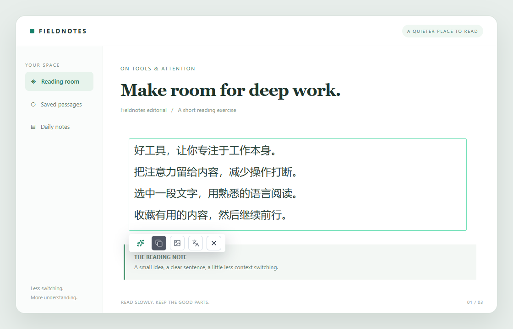
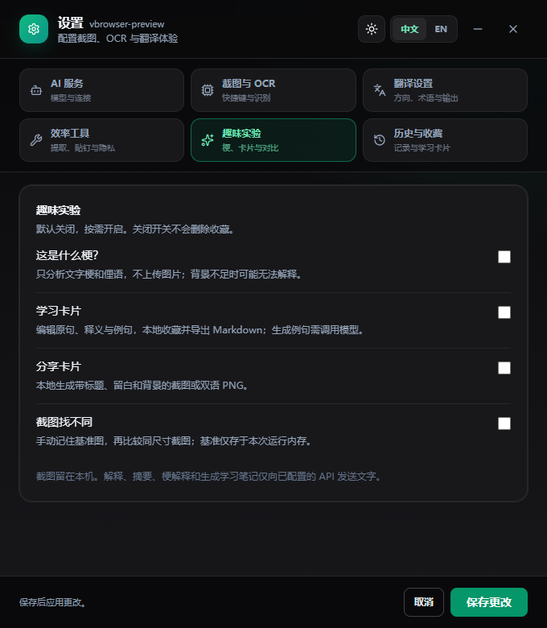
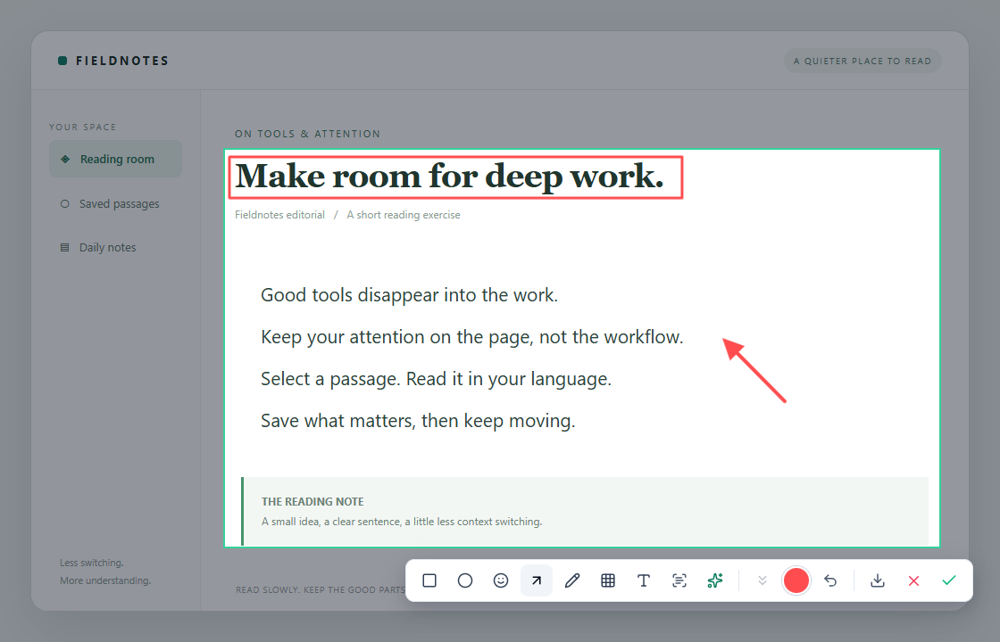
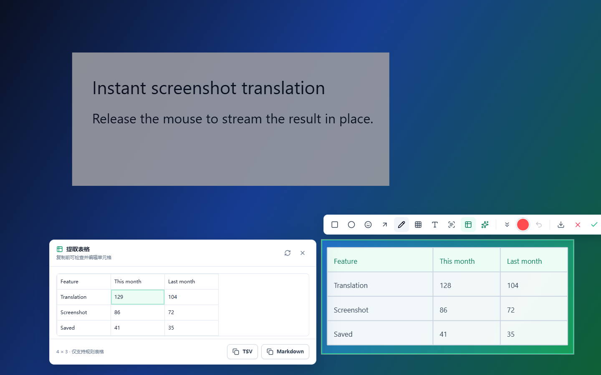

<div align="center">

# snapTrans

**面向 Windows 的轻量级选词翻译、截图翻译与截图标注工具**

选中文字后按原有快捷键，直接在原位置显示译文；没有选中文字时，框选屏幕，松手即翻译。

[](https://www.microsoft.com/windows/)
[](https://wails.io/)
[](https://go.dev/)
[](https://vuejs.org/)
[](LICENSE)

[界面预览](#screenshots) · [快速开始](#-快速开始) · [核心功能](#-核心功能) · [配置说明](#%EF%B8%8F-配置说明) · [本地开发](#-本地开发) · [项目架构](#%EF%B8%8F-项目架构)

<a href="docs/images/translation.png">
  
</a>

**框选一下，译文就在原处。**

<sub>当前前端界面的实际渲染截图，阅读页面和译文使用演示素材；未调用真实 OCR 或在线模型。</sub>

</div>

---

## ✨ 为什么选择 snapTrans

snapTrans 将“截图、识别、翻译、阅读”压缩成一次自然的鼠标动作。它不会在框选完成后弹出确认窗口，也不会打断当前工作流。

| 工作模式 | 默认快捷键 | 交互体验 |
| --- | --- | --- |
| 选词 / 截图翻译 | <kbd>Alt</kbd> + <kbd>Q</kbd> | 有可靠文字选区 → 直接原位翻译；否则冻结屏幕 → 框选 → 松手翻译 |
| 截图涂鸦 | <kbd>Alt</kbd> + <kbd>W</kbd> | 冻结屏幕 → 拖出选区 → 标注或向下滚动拼接 → 复制或保存 PNG |

> 两套快捷键互相独立。截图翻译始终保持“松手即翻译”，截图涂鸦则在选区旁显示紧凑工具栏。

<a id="screenshots"></a>

## 📸 界面预览

六张分类卡片直达常用设置，保存按钮始终可见。浅色与深色主题自由切换，趣味工具按需开启。

<table>
  <tr>
    <th width="50%">浅色 · 截图与 OCR</th>
    <th width="50%">深色 · 趣味实验</th>
  </tr>
  <tr>
    <td><a href="docs/images/settings-light.png"></a></td>
    <td><a href="docs/images/settings-dark.png"></a></td>
  </tr>
</table>

<details>
<summary><b>截图标注：用矩形和箭头突出重点</b></summary>

框选后直接标注，工具栏跟随选区，支持复制与保存图片。

[](docs/images/annotation.png)

</details>

<details>
<summary><b>表格提取：识别后先检查，再复制 TSV 或 Markdown</b></summary>

仅在截图涂鸦中出现。截图框内的规则表格由本地 OCR 提供文字与位置，单元格可以直接修正。

[](docs/images/table-extraction.png)

</details>
<details>
<summary><b>分享卡片：给截图加上标题、留白和背景</b></summary>

在本机生成 PNG，保留已有标注；可以复制或保存，不会自动分享。

<p align="center">
  <a href="docs/images/share-card.png"></a>
</p>

</details>

<sub>点击图片可查看大图。截图来源与更新方式见 [图片说明](docs/images/README.md)。</sub>

## 🚀 核心功能

### 选词与截图翻译

- **同一个快捷键**：选中文字按 Alt+Q 直接翻译，跳过框选和 OCR；不用 Ctrl+C，不读取或改写剪贴板。
- **兼容兜底**：应用不提供可靠选区、跨屏或超出可见范围时回到框选；托盘 Capture 始终手动框选。文字读取限制 350ms，慢应用不会阻塞后续操作。

- **本地 OCR**：通过 RapidOCR 在本机完成文字识别。
- **原位覆盖**：译文直接显示在截图选区上，不需要切换窗口。
- **流式响应**：兼容 DeepSeek、LiteLLM 及其他 OpenAI-compatible API。
- **智能排版**：根据 OCR 文本块位置，在表格、表单和长文本之间自动选择合适布局。
- **自动方向**：自动判断中译英或英译中，也可以针对当前结果手动反向翻译。
- **高 DPI 支持**：处理多显示器、缩放比例和物理像素映射，减少选区偏移。

### 微信式截图涂鸦

- 矩形、椭圆、实心箭头、自由画笔
- 马赛克、文字、表情标注
- 自定义标注颜色与撤销
- 微信式手动滚动长截图：选区实时显示当前滚动画面，旁边同步预览完整长图；每次滚动由用户控制，点击完成后生成长图
- 从截图工具栏提取规则表格：本地 OCR 推断行列，预览中可编辑单元格，再复制为 TSV 或 Markdown
- 完成后复制到剪贴板，或通过 Windows 原生对话框保存 PNG
- 工具栏自动贴合选区并避让屏幕边缘

### 桌面体验

- 全局快捷键可视化录入
- Windows 系统托盘：`Capture`、`Screenshot`、`Settings`、`Quit`
- RapidOCR 常驻预热，失败时自动回退到单次调用
- 最近 50 条翻译历史
- 自动复制、开机自启、连接测试和本地诊断日志
- 中英文设置界面与单实例保护

### 可开关的扩展工具

设置顶部提供六张固定分类卡片：AI 服务、截图与 OCR、翻译设置、效率工具、趣味实验、历史与收藏。点击卡片只显示对应内容；导航和底部保存 / 取消始终可见，切换分类保留未保存编辑，本次运行内记住上次分类。支持方向键、Home / End 切换；保存时自动定位填写错误的字段。学习卡片在“历史与收藏”中管理。

在设置里的“效率工具 / 趣味实验”逐项开启或关闭。翻译仍然松手即开始，不增加确认步骤。截图与翻译结果工具栏的 **扩展工具** 按钮打开统一面板。

| 功能 | 默认 | 使用方式 |
| --- | --- | --- |
| 提取文字 | 开启 | 截图工具栏提取原文，可编辑、合并换行或恢复 OCR 换行；仅本地运行 |
| 表格提取 | 开启 | 仅在截图涂鸦工具栏使用；本地 OCR 推断规则表格的行列，预览编辑后复制 TSV 或 Markdown |
| 截图 / 译文贴钉 | 开启 | 扩展工具中贴钉；拖动移动，滚轮缩放，Ctrl+滚轮调透明度；右键开启鼠标穿透或关闭 |
| 解释 / 三句话摘要 | 开启 | 在扩展工具里编辑选区文字，再主动点击操作；复用当前模型配置 |
| 隐私遮挡助手 | 开启 | 截图扩展工具中本地检测邮箱和常见电话，检查候选项后用实心色块遮挡；一次撤销整批遮挡 |
| 历史搜索 / 收藏 | 开启 | 在设置中搜索原文与译文、收藏和导出 Markdown；收藏不受最近 50 条限制 |
| 文字梗解释 | 关闭 | 开启后解释俚语、双关、语气；仅支持文字上下文，不分析画面 |
| 学习卡片 | 关闭 | 编辑原句、释义和例句后本地保存；可选择调用模型生成笔记，在设置里搜索、删除、导出 Markdown |
| 分享卡片 | 关闭 | 给当前截图增加标题、留白和背景，或从翻译结果生成双语 PNG；复制或保存，不自动分享 |
| 截图找不同 | 关闭 | 手动记住基准图，再截相同尺寸区域进行像素对比；红色标出变化 |

注意：

- 解释、摘要、梗解释和生成学习笔记只在主动点击后发送文字，截图不上传。生成内容可能有误，需要核对。
- 关闭扩展面板、开始新截图或打开设置会取消对应的文字流，旧请求不会覆盖新结果。
- 贴钉是独立 Windows 原生窗口，最多 12 个；不影响继续截图。开启穿透后，可从托盘 **Unlock pins / 恢复贴钉交互** 恢复，也可 **Close pins / 关闭所有贴钉**。退出程序时关闭全部贴钉，不落盘保存截图。
- 隐私检测可能漏检，只覆盖邮箱和常见电话；命中时遮挡整个 OCR 文本块。分享前务必检查，不能将“没有匹配项”当作没有隐私内容。
- “清空最近”保留收藏与学习卡片；关闭功能开关不会删除保存的数据。收藏和卡片沿用本地历史文件，包含明文原文及笔记。
- 截图对比不自动对齐，不解释语义变化。基准图只保留在内存，退出程序或关闭对比功能后清除。
- 表格提取按 OCR 文字块位置推断规则矩形表格，不识别跨行、跨列的合并单元格；OCR 或行列判断不准时可在预览中手动修正。
- 图片处理限制为 1600 万像素；分享卡片文字最多 12000 字符。浏览器预览演示模型回复，不执行真实 OCR 或 API 请求，原生贴钉仅在 Windows 应用可用。

扩展设计、边界与后续计划见 [docs/EXTENSIONS.md](docs/EXTENSIONS.md)。

## 📦 快速开始

### 下载发布版

从 [GitHub Releases](https://github.com/papacs/snapTrans/releases) 下载最新的
`snapTrans-vX.Y.Z-windows-x64.zip` 并完整解压。发布包已经包含 RapidOCR-json
程序和所需模型，不需要另外下载 OCR 文件。

解压后的目录结构如下：

```text
snapTrans-vX.Y.Z-windows-x64/
├── snapTrans.exe
├── LICENSE
├── RELEASE-NOTES.md
├── THIRD-PARTY-NOTICES.md
└── RapidOCR-json_v0.2.0/
    ├── RapidOCR-json.exe
    └── models/
```

1. 运行 `snapTrans.exe`，应用会进入系统托盘。
2. 右键托盘图标，打开 `Settings`。
3. 配置 API Key、Base URL 和模型名称。
4. 确认 RapidOCR 路径，保存设置。
5. 选中文字后按 <kbd>Alt</kbd> + <kbd>Q</kbd> 原位翻译；不选择文字则进入框选。<kbd>Alt</kbd> + <kbd>W</kbd> 仍用于截图涂鸦。

原生选词翻译不依赖 OCR，也不向模型发送图片；截图翻译仍需保留 RapidOCR。已验证自建 Windows EDIT 控件及 Chrome 测试页面的选区读取，其他应用取决于 UI Automation 支持情况。

RapidOCR 路径既可以填写文件夹，也可以填写完整可执行文件路径：

```text
./RapidOCR-json_v0.2.0
D:/Tools/RapidOCR-json_v0.2.0
D:/Tools/RapidOCR-json_v0.2.0/RapidOCR-json.exe
```

## ⚙️ 配置说明

默认配置与当前代码保持一致：

| 配置项 | 默认值 | 说明 |
| --- | --- | --- |
| 翻译快捷键 | `Alt+Q` | 优先选中文字直译，无可靠选区则框选翻译 |
| 截图涂鸦快捷键 | `Alt+W` | 松开鼠标后进入标注模式 |
| API Base URL | `https://api.deepseek.com` | 支持 OpenAI-compatible 服务 |
| 模型 | `deepseek-v4-flash` | 可替换为服务商暴露的模型 ID |
| RapidOCR 路径 | `./RapidOCR-json_v0.2.0` | 支持文件夹或 EXE 路径 |
| OCR 超时 | `15s` | 单次识别最大等待时间 |
| 翻译超时 | `60s` | 翻译接口无响应时的最大等待时间 |
| 自动识别方向 | 开启 | 根据源文本自动选择翻译方向 |
| OCR 常驻预热 | 开启 | 降低第一次及后续识别延迟 |

设置会保存到当前用户的系统配置目录。开发环境也可以通过根目录 `.env` 提供配置：

```dotenv
LLM_API_KEY=your_api_key
LLM_BASE_URL=https://your-openai-compatible-host/v1
LLM_MODEL=your-model-id

RAPIDOCR_EXE_PATH=./RapidOCR-json_v0.2.0
RAPIDOCR_TIMEOUT_SECONDS=15
SNAPTRANS_TRANSLATION_TIMEOUT_SECONDS=60

SNAPTRANS_SHORTCUT=Alt+Q
SNAPTRANS_SCREENSHOT_SHORTCUT=Alt+W
SNAPTRANS_AUTO_DIRECTION=true
SNAPTRANS_PERSISTENT_OCR=true
SNAPTRANS_AUTO_COPY=false
```

> 请勿提交真实 API Key、`.env`、OCR 二进制文件或本地配置。

## 🛠 本地开发

### 环境要求

- Windows 10/11
- Go 1.22+
- Node.js 22+ 与 npm
- Wails v2 CLI
- RapidOCR-json v0.2.0（Windows x64 构建时自动准备）
- DeepSeek、LiteLLM 或其他 OpenAI-compatible API 凭据

### 安装与启动

```powershell
git clone https://github.com/papacs/snapTrans.git
cd snapTrans

Copy-Item .env.sample .env

cd frontend
npm install
cd ..

wails dev
```

仅预览前端界面：

```powershell
cd frontend
npm run dev
```

浏览器预览模式会生成模拟截图和流式翻译事件，不依赖 Wails 或本地 OCR。

### 构建

```powershell
cd frontend
npm run build
cd ..

wails build
```

Windows x64 下，`wails build`（以及 `wails dev` 的初次编译）会通过构建钩子自动准备
RapidOCR-json v0.2.0 和模型，输出到 `build/bin/RapidOCR-json_v0.2.0/`。
首次需要联网访问 GitHub Releases 和 npm registry；下载固定版本并校验 SHA-256，
缓存保存在 `build/ocr-cache/`。已有完整 OCR 输出目录时直接复用，无需再次下载。
下载或解压失败会中止构建并提示原因。

已有项目根目录下的 `RapidOCR-json_v0.2.0/` 会自动复制到构建输出，原目录保留。
其他位置的完整 OCR 目录也可手动复用，无需移动原文件：

```powershell
.\scripts\ensure-rapidocr.ps1 -SourceDirectory 'D:\Tools\RapidOCR-json_v0.2.0'
wails build
```

分发时请保留 `snapTrans.exe` 同级的整个 OCR 文件夹，或运行
`.\scripts\package-release.ps1 -Version 0.2.0` 生成包含依赖的 ZIP。
OCR 二进制、模型和下载缓存均不提交到源码仓库。

## ✅ 质量验证

```powershell
# 前端测试、类型检查与生产构建
cd frontend
npm test
npm run typecheck
npm run build

# Go 后端测试
cd ..
go test ./...
```

重点测试范围包括：

- DPI 与截图选区坐标映射
- 截图/翻译状态切换和过期事件隔离
- OCR 输出解析、常驻 worker 与回退策略
- 配置迁移、双快捷键和历史记录
- 翻译布局、流式输出与截图标注几何

## 🏗️ 项目架构

```text
snapTrans/
├── main.go                        # 进程入口、单实例保护与资源嵌入
├── internal/
│   ├── desktop/                   # Wails 控制器、工作流与 Windows 原生界面
│   ├── capture/                   # 屏幕捕获、DPI 与显示器元数据
│   ├── config/                    # 用户配置、默认值与环境变量
│   ├── hotkeys/                   # 全局快捷键注册
│   ├── ocr/                       # RapidOCR worker、解析与回退
│   ├── translator/                # OpenAI-compatible 流式翻译
│   ├── history/                   # 本地翻译历史
│   ├── autostart/                 # Windows 开机自启
│   ├── logfile/                   # 本地诊断日志
│   └── singleinstance/            # 单实例保护
├── frontend/src/
│   ├── App.vue                    # 捕获、翻译和设置主状态机
│   ├── components/                # 截图标注等独立组件
│   ├── services/backend.ts        # Wails 调用边界与浏览器 fallback
│   ├── utils/selection.ts         # 坐标映射、裁剪与翻译布局
│   └── utils/annotations.ts       # 标注几何与 Canvas 渲染
├── scripts/                       # 发布包等可复现维护脚本
└── website/                       # Cloudflare Pages 双语官网
```

核心数据流：

```text
全局快捷键
   ↓
冻结当前显示器 → 框选区域 → 本地 RapidOCR
   ↓                           ↓
截图涂鸦 / 复制 / 保存        仅发送识别后的文本
                               ↓
                     OpenAI-compatible 流式翻译
                               ↓
                         原屏幕区域覆盖显示
```

## 🔐 隐私与安全

- 截图和 OCR 处理保留在本机；翻译服务仅接收 OCR 提取出的文本。
- API Key 保存在用户本地配置中，不应写入源码或提交到 Git。
- snapTrans 不包含遥测；错误和耗时只写入本地日志。
- GitHub Release 便携包包含 RapidOCR-json v0.2.0 及所需模型；Windows x64 源码构建会自动准备该依赖，首次构建需要联网。

## 🤝 参与贡献

欢迎提交 Issue 和 Pull Request。修改代码时请优先保证：

1. 松开鼠标后立即翻译，不增加确认步骤。
2. DPI、多显示器和坐标映射保持正确。
3. 前后端调用统一通过明确边界，并为状态转换和解析行为补充测试。
4. 不提交 API Key、OCR 二进制、生成构建产物或本地配置。

更多开发约定请查看 [AGENTS.md](AGENTS.md)，待办事项请查看 [docs/TODO.md](docs/TODO.md)。

## 📄 License

本项目基于 [MIT License](LICENSE) 开源。

---

<div align="center">

**snapTrans — capture less, understand faster.**

</div>
